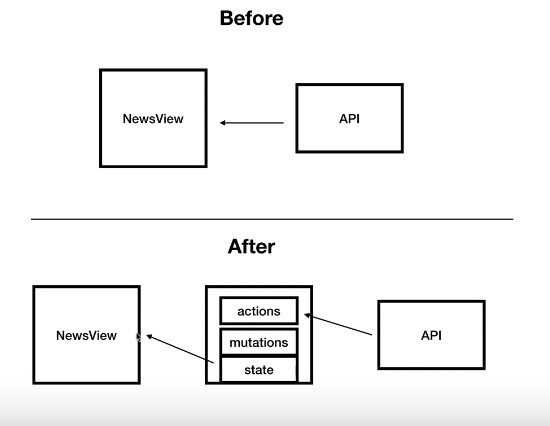

안녕하세요, 잘 올라가는지 테스트입니다. 

![vuex]](../assets/images/0306_테스트용/vuex.png)



![vuex]](../assets/images/test/vuex.png)


이미지도 잘 올라가는지 테스트~

| 제목 | 작성일 | 작성자 |
| --- | --- | --- |
| 작성가이드 | 2022-03-06 | 조영주 |

ㅎㅎ
```java
void main class

//test

```

테스트끝